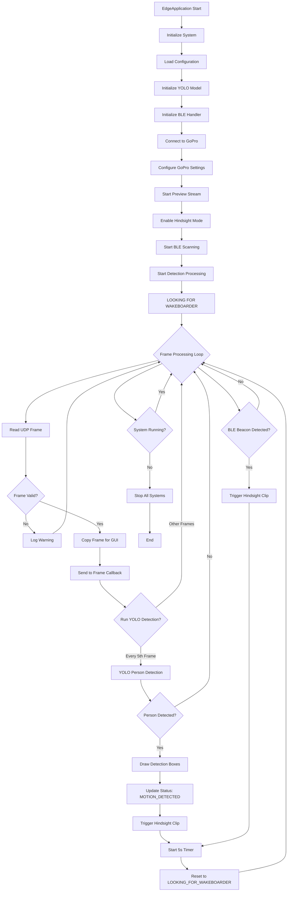

# EdgeApplication Documentation

## Overview

The EdgeApplication is the core component of the BearVision EDGE system, designed for real-time wakeboard detection and automatic video clip generation. It coordinates multiple subsystems including GoPro camera control, YOLO object detection, BLE beacon monitoring, and hindsight clip recording.

## System Architecture

### Core Components

1. **GoPro Integration** - Camera control and video streaming
2. **YOLO Detection** - Real-time person detection using YOLOv8
3. **BLE Monitoring** - Bluetooth beacon proximity detection
4. **Video Processing** - Frame capture and processing pipeline
5. **Hindsight Recording** - Automatic clip generation on detection

## System Flow



## State Machine

The EdgeApplication operates with the following states:

### Primary States
- **INITIALIZING** - System startup and component initialization
- **READY** - All systems initialized, waiting for commands
- **LOOKING_FOR_WAKEBOARDER** - Active monitoring with preview and detection
- **MOTION_DETECTED** - Person detected, triggering recording
- **RECORDING** - Hindsight clip being recorded
- **ERROR** - System error state
- **STOPPED** - System shutdown

### Status Tracking
```python
class SystemStatus:
    overall_status: EdgeStatus
    gopro_connected: bool = False
    preview_active: bool = False
    ble_active: bool = False
    hindsight_mode: bool = False
    detection_active: bool = False
```

## Key Methods

### System Lifecycle
- `initialize()` - Initialize all subsystems
- `start_system()` - Complete system startup sequence
- `stop_system()` - Graceful system shutdown

### GoPro Control
- `connect_gopro()` - Connect and configure GoPro camera
- `start_preview()` - Begin UDP video stream
- `stop_preview()` - Stop video stream
- `trigger_hindsight()` - Enable hindsight mode (continuous buffering)
- `trigger_hindsight_clip()` - Record a hindsight clip

### Detection Processing
- `_detection_worker()` - Main frame processing thread
- `_process_frame_detection_with_boxes()` - YOLO detection with bounding boxes
- `_draw_detection_boxes()` - Draw green detection rectangles

## Video Processing Pipeline

### Frame Flow
1. **UDP Stream Capture** - Read frames from GoPro UDP stream (`udp://172.24.106.51:8554`)
2. **Frame Validation** - Check frame integrity and format
3. **Frame Copying** - Create thread-safe copy for GUI
4. **YOLO Processing** - Run person detection every 5th frame
5. **Box Drawing** - Overlay green bounding boxes
6. **GUI Callback** - Send processed frame to user interface
7. **Detection Response** - Trigger recording if person detected

### Stream Configuration
- **Resolution**: 1080p (1920x1080)
- **Frame Rate**: ~30 FPS
- **Processing Rate**: ~23 FPS (optimized)
- **Detection Frequency**: Every 5th frame
- **Buffer Size**: 1 frame (minimal latency)

## Detection Logic

### YOLO Integration
```python
def _process_frame_detection_with_boxes(self, frame: np.ndarray) -> list:
    detection_result = self.dnn_handler.find_person(frame)
    if detection_result and len(detection_result) == 2:
        detected_boxes, confidences = detection_result

        for box, confidence in zip(detected_boxes, confidences):
            if confidence > 0.5:  # 50% confidence threshold
                # Convert [x, y, w, h] to [x1, y1, x2, y2]
                x, y, w, h = box
                boxes.append({
                    'coords': [x, y, x + w, y + h],
                    'confidence': confidence,
                    'label': 'Person'
                })

    return boxes
```

### Detection Response
- **Threshold**: 50% confidence minimum
- **Action**: Trigger hindsight clip recording
- **Duration**: 1 second clip capture
- **Cooldown**: 5 second reset timer

## BLE Integration

### Beacon Detection
- **Purpose**: Detect wakeboarder proximity via Bluetooth beacons
- **Action**: Automatically trigger hindsight recording
- **Range**: Configurable distance threshold
- **Response**: Same as YOLO detection (hindsight clip)

## Configuration System

### Configuration Sources
1. **config.ini** - Main application settings
2. **test/test_config.ini** - Test environment settings

### Key Settings
- **YOLO Model**: Model selection (yolov8n, yolov8s, etc.)
- **Detection Threshold**: Confidence level for person detection
- **GoPro Settings**: Resolution, frame rate, hindsight duration
- **BLE Settings**: Beacon scanning parameters
- **Network Settings**: UDP stream configuration

## Error Handling

### Connection Issues
- **GoPro Connection**: Retry logic with exponential backoff
- **Stream Errors**: Automatic reconnection attempts
- **Model Loading**: Graceful fallback to mock detection

### Logging System
- **Levels**: DEBUG, INFO, WARNING, ERROR
- **Callback**: Real-time log forwarding to GUI
- **Format**: Structured logging with timestamps

## GUI Integration

### Callback System
```python
def __init__(self,
             status_callback=None,
             detection_callback=None,
             log_callback=None,
             frame_callback=None):
```

### Real-time Updates
- **Status Updates**: System state changes
- **Frame Stream**: Live video with detection overlays
- **Log Messages**: Real-time system logging
- **Detection Events**: Person detection notifications

## Automatic Startup Sequence

The EdgeApplication supports automatic initialization:

1. **Initialize** - Load configuration and models (1s delay)
2. **Connect GoPro** - Establish camera connection (2s delay)
3. **Start Preview** - Begin video stream (1.5s delay)
4. **Enable Hindsight** - Activate continuous buffering (1s delay)
5. **Ready State** - System active and monitoring

## Performance Characteristics

### Resource Usage
- **Memory**: ~200MB (including YOLO model)
- **CPU**: Moderate (frame processing + YOLO inference)
- **Network**: ~10-15 Mbps (1080p UDP stream)
- **Storage**: Minimal (clips saved to GoPro)

### Timing
- **Startup Time**: ~6 seconds (with delays)
- **Detection Latency**: <100ms
- **Frame Processing**: 30-50ms per frame
- **Recording Response**: <200ms

## Threading Model

### Thread Structure
- **Main Thread**: GUI and system coordination
- **Detection Worker**: Frame processing and YOLO detection
- **BLE Scanner**: Bluetooth beacon monitoring
- **Backend Thread**: EdgeApplication management

### Thread Safety
- **Frame Copying**: Prevents threading conflicts
- **Status Updates**: Thread-safe status management
- **Callback System**: Asynchronous event handling

## Troubleshooting

### Common Issues

1. **No Preview Stream**
   - Check GoPro connection and USB cable
   - Verify UDP stream URL (172.24.106.51:8554)
   - Check firewall settings for UDP traffic

2. **YOLO Detection Fails**
   - Verify model file exists in `dnn_models/`
   - Check OpenCV DNN module installation
   - Review confidence threshold settings

3. **BLE Not Working**
   - Ensure Bluetooth adapter is available
   - Check beacon battery and proximity
   - Verify BLE permissions on system

### Debug Commands
```bash
# Test GoPro connection
python tools/simple_gopro_test.py

# Test UDP stream
python tools/direct_udp_test.py

# Test complete pipeline
python tools/test_preview_pipeline.py

# Test hindsight functionality
python tools/test_hindsight_changes.py
```

## API Reference

### EdgeApplication Class

#### Constructor
```python
def __init__(self, status_callback=None, detection_callback=None,
             log_callback=None, frame_callback=None)
```

#### Public Methods
- `initialize() -> bool` - Initialize all subsystems
- `start_system() -> bool` - Start complete system
- `stop_system() -> None` - Stop all processing
- `connect_gopro() -> bool` - Connect to GoPro
- `start_preview() -> bool` - Start video stream
- `trigger_hindsight() -> bool` - Enable hindsight mode
- `trigger_hindsight_clip() -> bool` - Record hindsight clip

#### Status Properties
- `status: SystemStatus` - Current system status
- `running: bool` - System running state
- `initialized: bool` - Initialization state

## Version History

### v2.0.0 (Current)
- Complete EdgeApplication rewrite with threading
- YOLO detection integration with bounding boxes
- Automatic startup sequence
- Enhanced error handling and logging
- BLE beacon integration
- Real-time GUI callbacks

### v1.0.0 (Legacy)
- Basic GoPro control
- Simple motion detection
- Manual operation only

## Future Enhancements

### Planned Features
- **Multi-camera Support** - Support for multiple GoPro cameras
- **Cloud Integration** - Direct upload to cloud storage
- **Advanced Detection** - Trick recognition and classification
- **Mobile App** - Remote monitoring and control
- **Analytics Dashboard** - Detection statistics and performance metrics

### Performance Improvements
- **GPU Acceleration** - CUDA support for YOLO inference
- **Stream Optimization** - Lower latency video processing
- **Battery Management** - Power-efficient operation modes
- **Caching System** - Model and configuration caching