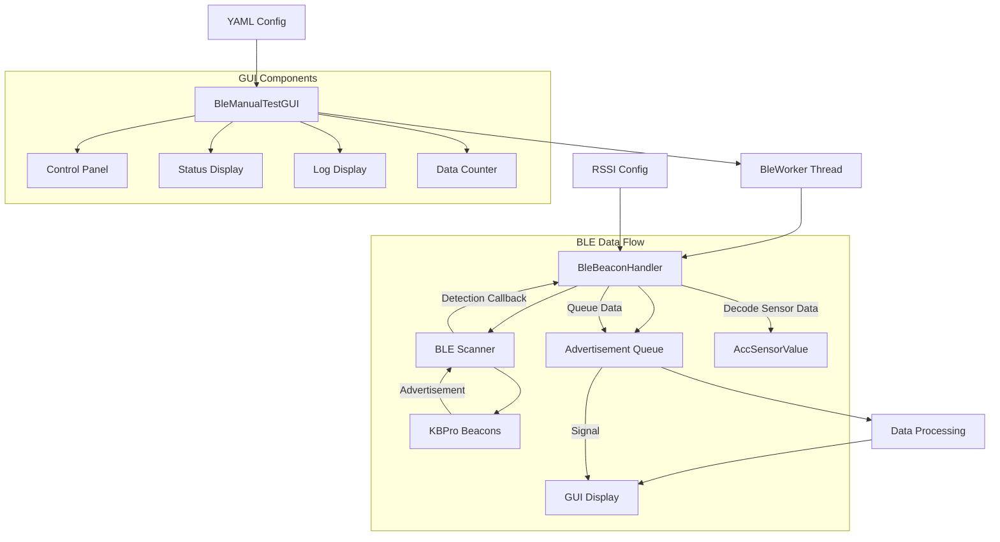
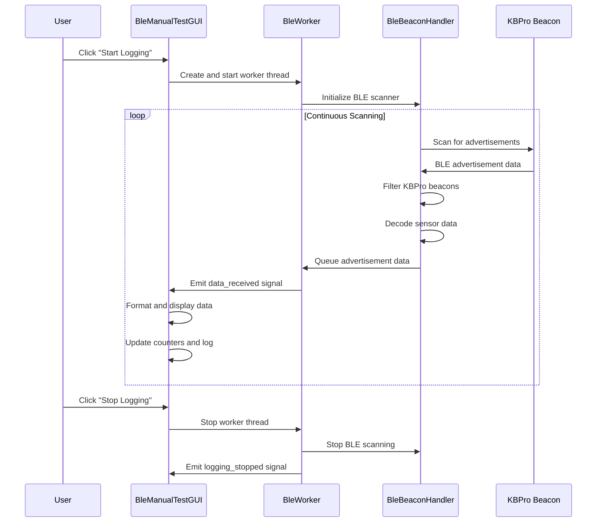

# BLE Beacon System Documentation

## Overview

The BLE Beacon System consists of two main components:
1. **BleBeaconHandler** (`code/modules/ble_beacon_handler.py`) - Core BLE scanning and data processing module
2. **BleManualTestGUI** (`tools/ble_manual_test_gui.py`) - PySide6-based GUI for manual testing and real-time data visualization

This system is designed to scan for KBPro BLE beacons, decode their sensor data (accelerometer and battery), and provide real-time monitoring capabilities for the BearVision wakeboard detection system.

## Architecture Overview



## BleBeaconHandler Module

### Core Functionality

The `BleBeaconHandler` class provides asynchronous BLE beacon scanning and data processing capabilities.

#### Key Features
- **Asynchronous BLE scanning** using the `bleak` library
- **KBPro beacon filtering** - Only processes beacons with "KBPro" in the name
- **Sensor data decoding** - Extracts accelerometer and battery data from advertisement packets
- **Movement detection** - Determines if the beacon is moving based on accelerometer readings
- **RSSI to distance conversion** - Estimates distance using calibrated RSSI values

#### Public Interface

```python
class BleBeaconHandler:
    def __init__(self)
    def start_scan(self, timeout=0.0)
    async def start_scan_async(self, timeout=0.0)
    async def look_for_advertisements(self, timeout=0.0)
    async def process_advertisements(self)
    async def discovery_callback(self, device, advertisement_data)
    def decode_sensor_data(self, data)
```

#### Data Structures

```python
class AccSensorValue:
    x: float          # X-axis acceleration (g)
    y: float          # Y-axis acceleration (g) 
    z: float          # Z-axis acceleration (g)
    norm: float       # Magnitude of acceleration vector
    diff_from_1_g: float  # Difference from 1g (gravity)
    is_moving: bool   # Movement detection flag
```

#### Advertisement Data Dictionary
```python
{
    'address': str,           # BLE device address
    'name': str,             # Device name (e.g., "KBPro-1234")
    'rssi': int,             # Signal strength (dBm)
    'tx_power': int,         # Transmission power
    'batteryLevel': int,     # Battery level (0-100)
    'acc_sensor': AccSensorValue,  # Accelerometer data
    'distance': float        # Estimated distance (meters)
}
```

### Configuration

The module uses an INI configuration file for RSSI-to-distance calibration:
- **Default location**: `rssi_distance.ini` (two levels up from module)
- **Format**: RSSI values mapped to corresponding distances using scipy interpolation

### Constants and Thresholds

```python
KSENSOR_TYPE = 0x21           # Sensor data type identifier
MIN_SENSOR_ADV_LEN = 3        # Minimum advertisement length
SENSOR_MASK_VOLTAGE = 0x1     # Battery data mask
SENSOR_MASK_ACC_AIX = 0x8     # Accelerometer data mask
MOVEMENT_THRESHOLD = 0.1      # Movement detection threshold (g)
```

## BleManualTestGUI Application

### Overview

The GUI application provides a user-friendly interface for manual testing of BLE beacons with real-time data visualization and logging capabilities.

### Architecture Components

#### Threading Model
- **Main Thread**: GUI operations and user interface
- **Worker Thread** (`BleWorker`): BLE scanning and data processing
- **Signal/Slot Communication**: Thread-safe data transfer using Qt signals

#### Configuration System
- **YAML-based configuration** (`ble_test_gui_config.yaml`)
- **Fallback to defaults** if configuration file is missing or invalid
- **Configurable GUI elements**: fonts, colors, display options, logging parameters

### Key Classes

#### BleWorker (QThread)
```python
class BleWorker(QThread):
    def __init__(self, config: Dict[str, Any])
    def run(self)
    async def _scan_and_process(self)
    async def _process_advertisements(self)
    def stop(self)
```

**Responsibilities:**
- Manages BLE scanning lifecycle in separate thread
- Processes advertisement queue with timeout handling
- Emits Qt signals for thread-safe GUI updates
- Handles graceful shutdown and error reporting

#### BleDataSignals (QObject)
```python
class BleDataSignals(QObject):
    data_received = Signal(dict)      # New BLE data available
    error_occurred = Signal(str)      # Error message
    logging_started = Signal()        # Scanning started
    logging_stopped = Signal()        # Scanning stopped
```

#### BleManualTestGUI (QMainWindow)
```python
class BleManualTestGUI(QMainWindow):
    def __init__(self)
    def load_configuration(self)
    def setup_ui(self)
    def start_logging(self)
    def stop_logging(self)
    def handle_ble_data(self, data: Dict[str, Any])
    def format_ble_data(self, data: Dict[str, Any]) -> str
    def add_log_message(self, message: str)
```

### Configuration Schema

```yaml
ble:
  scan_timeout: 0.0              # 0 = infinite scanning
  movement_threshold: 0.1        # Movement detection threshold (g)

gui:
  window_title: "BLE Tag Manual Test GUI"
  window_width: 800
  window_height: 600
  log_max_lines: 1000           # Maximum log display lines
  log_font_family: "Consolas"
  log_font_size: 9
  auto_scroll: true             # Auto-scroll to newest data
  
  # Display options
  show_timestamp: true
  show_address: true
  show_name: true
  show_rssi: true
  show_distance: true
  show_battery: true
  show_accelerometer: true
  show_movement: true
  
  # Optional styling
  background_color: "#000000"
  text_color: "#00FF00"

logging:
  level: "INFO"
  format: "%(asctime)s - %(levelname)s - %(message)s"
```

## System Flow

### Startup Sequence
1. **GUI Initialization**
   - Load YAML configuration (fallback to defaults)
   - Setup logging system
   - Create user interface components
   - Initialize BLE worker (not started)

2. **Configuration Loading**
   - Parse YAML configuration file
   - Handle missing or invalid configuration gracefully
   - Apply GUI styling and display preferences

### Data Processing Flow



### Data Display Format

The GUI formats received data into human-readable log entries:

```
[14:23:45.123] #0001 | ID: AA:BB:CC:DD:EE:FF | Name: KBPro-1234 | RSSI: -45 dBm | Dist: 2.31m | Batt: 85 | Acc: X:0.012g Y:0.045g Z:0.998g Norm:1.001g | Motion: STATIC
```

### Error Handling

#### BLE Scanning Errors
- **Scanner initialization failures**: Display error popup and log message
- **Advertisement processing errors**: Continue scanning, log error details
- **Timeout handling**: Normal operation, continues scanning loop

#### Configuration Errors
- **Missing YAML file**: Use default configuration, show warning popup
- **Invalid YAML syntax**: Parse error handling, fallback to defaults
- **Missing RSSI calibration**: Distance calculations disabled, log warning

#### Thread Safety
- **Qt Signals**: Ensure thread-safe communication between worker and GUI
- **Exception handling**: Catch and report errors without crashing
- **Graceful shutdown**: Clean termination of scanning threads

## Usage Instructions

### Prerequisites
- Python 3.8+ with PySide6, bleak, PyYAML, scipy, numpy
- BLE adapter (built-in or USB dongle)
- KBPro BLE beacons in range

### Running the Application
```bash
python tools/ble_manual_test_gui.py
```

### Configuration Setup
1. Create `tools/ble_test_gui_config.yaml` with desired settings
2. Adjust display options and styling preferences
3. Configure BLE scanning parameters

### Testing Workflow
1. **Start Application**: Launch GUI and verify configuration loading
2. **Begin Scanning**: Click "Start Logging" to begin BLE beacon detection
3. **Monitor Data**: Observe real-time data in scrollable log display
4. **Data Analysis**: Review accelerometer readings, battery levels, signal strength
5. **Stop Scanning**: Click "Stop Logging" to end data collection

## Integration with BearVision System

The BLE Beacon System integrates with the broader BearVision wakeboard detection system by:

1. **Motion Detection**: Accelerometer data helps identify wakeboard tricks and movements
2. **User Tracking**: Beacon proximity and movement patterns correlate with GPS data
3. **Battery Monitoring**: Ensures beacons remain operational during recording sessions
4. **Distance Estimation**: RSSI-based ranging assists with spatial tracking

The system provides essential sensor data that enhances the computer vision pipeline's ability to automatically detect and capture wakeboard highlight moments.

## Development Notes

### Dependencies
- **bleak**: Cross-platform BLE library for Python
- **PySide6**: Qt6-based GUI framework
- **asyncio**: Asynchronous I/O for BLE operations
- **scipy**: Scientific computing for RSSI interpolation
- **PyYAML**: YAML configuration file parsing

### Testing Considerations
- **Hardware Requirements**: Physical BLE beacons for comprehensive testing
- **Platform Compatibility**: Windows, Linux, macOS BLE stack differences  
- **Power Management**: Beacon battery optimization and monitoring
- **Signal Interference**: Environmental factors affecting BLE reception