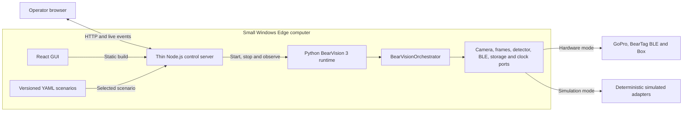
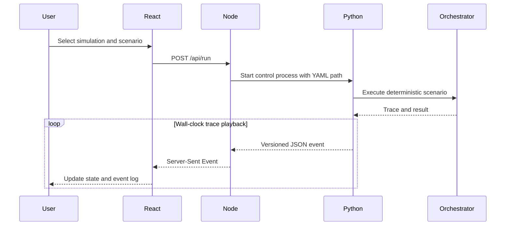

# Edge computer and control GUI

Status: first control slice implemented; real preview and scenario video remain
future work.

## Deployment boundary

The Edge computer hosts both runtimes. BearVision 3 targets a small Windows
computer for both development and production deployment. Hardware sizing is a
benchmarking question, not an application-architecture decision.

Node is deliberately a thin shell. Python owns the orchestrator, contracts and
all decisions. The React GUI must never duplicate rider assignment or capture
policy.

## Behavioural scenario playback

The scenario is currently executed deterministically first and its trace is
then replayed at wall-clock speed. This is sufficient for UI behaviour testing,
but it is not a physical real-time simulation.

## Next vertical slice: synchronized scenario video

Use an existing test video to produce one reproducible scenario bundle:

- source video or extracted preview frames;
- frame timestamps on the same monotonic timeline as scenario events;
- person-detection expectations or recorded detections;
- approximately 10 Hz BearTag RSSI and acceleration observations;
- expected capture, assignment and upload outcome.

The Python runtime should own synchronization. Node should only proxy the
preview stream and events to React. Before recording the bundle, define the
clock origin and how dropped or late BLE observations are represented.

## Known gaps

- The old React source under `temp/EDGE Application GUI Design` was an ignored
  mockup with mock events and no backend.
- The PyQt Edge GUI is wired to the legacy state machine, not BearVision 3.
- Hardware-mode preview transport is not implemented in Edge Control yet.
- Edge Control has no authentication; do not expose port 4310 outside a trusted
  local network.
