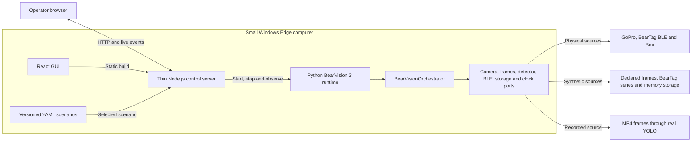
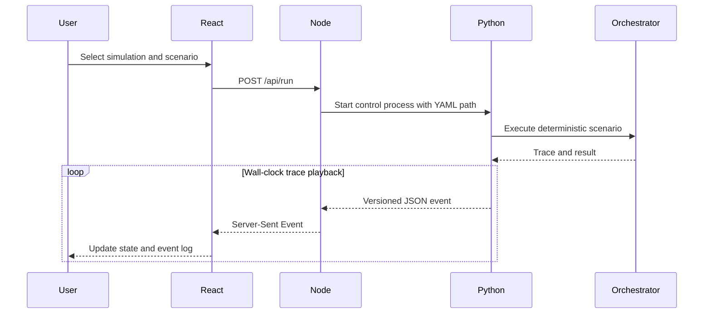

# Edge computer and control GUI

Status: control GUI and recorded-video regression implemented; physical preview
transport remains future work.

## Deployment boundary

The Edge computer hosts both runtimes. BearVision 3 targets a small Windows
computer for both development and production deployment. Hardware sizing is a
benchmarking question, not an application-architecture decision.



Node is deliberately a thin shell. Python owns the orchestrator, contracts and
all decisions. The React GUI must never duplicate rider assignment or capture
policy.

## Behavioural scenario playback



The scenario is executed deterministically first and its trace is then replayed
at wall-clock speed. For the recorded-video scenario, React plays the source
video on the same media timestamps as Python's frame-analysis trace. This is
sufficient for repeatable UI behaviour testing, but it is not a physical
real-time simulation.

## Scenario schema 3.x sources

Each scenario explicitly selects the adapter behind each port:

| Part | Current choices |
|---|---|
| Frames | `synthetic`, `video`, `gopro` |
| Detector | `declared`, `yolo` |
| BearTag | `synthetic`, `ble` |
| Camera | `simulated`, `recorded_video`, `gopro` |
| Storage | `memory`, `box` |

The schema can express future physical/hybrid combinations. The behavioural
runtime currently implements two deliberately tested compositions only:

- fully synthetic with declared detections;
- recorded video + real YOLO + synthetic BearTag + in-memory storage.

The GUI's Hardware mode uses the physical composition from `config/edge.yaml`;
arbitrary mixed physical/simulated compositions are not implemented yet and
fail explicitly instead of silently selecting the wrong adapter.

`wakeboard-video-yolo.yaml` combines the checked-in 15.3-second preview video,
the real bundled YOLOv8n model and deterministic 10 Hz RSSI/accelerometer data.
YOLO detects the rider at approximately T+6.0 s; the resulting five-second clip
window assigns `rider-video` using its whole-window BearTag evidence.

The recorded-video camera then uses the packaged FFmpeg/FFprobe executables on
the Edge computer to re-encode exactly T+6.0 through T+11.0. It validates the
result before an atomic rename, uploads only the extracted file and leaves the
source unchanged. Edge Control exposes the capture through a range-enabled,
capture-directory-confined endpoint and lets the operator switch between the
scenario source and extracted clip.

Node only serves scenario metadata/media and supervises Python. Python remains
the owner of synchronization, YOLO, capture and rider assignment.

Schema 3.1 additionally supports explicit synthetic BearTag samples. The
Blender generator samples rider motion at the configured BearTag rate, converts
world kinematic acceleration to accelerometer specific force (`a - gravity`),
and calculates camera-side RSSI with a declared log-distance path-loss model.
The generated source paths and radio assumptions are retained in the YAML.
The defaults (`-50 dBm` at one metre and path-loss exponent `2.0`) are test
assumptions, not measured BearTag calibration values.

```powershell
uv run bearvision-generate-blender-scenario `
  test/blender_scenes/wakeboard_fs360_60fps --force
```

Generated files under `specs/scenarios` appear in Edge Control's Simulation
scenario selector and can be replayed manually like any other video scenario.

## Known gaps

- The old React source under `temp/EDGE Application GUI Design` was an ignored
  mockup with mock events and no backend.
- The PyQt Edge GUI is wired to the legacy state machine, not BearVision 3.
- Hardware-mode preview transport is not implemented in Edge Control yet.
- Edge Control has no authentication; do not expose port 4310 outside a trusted
  local network.

## Windows media runtime

`uv sync --locked --extra edge` installs platform-specific FFmpeg and FFprobe
binaries inside `.venv`; administrator access and a system-wide FFmpeg install
are not required. Explicit `BEARVISION_FFMPEG` and `BEARVISION_FFPROBE` paths
override the packaged binaries when deployment policy requires managed tools.

Encoding policy is independently versioned in `config/edge.yaml` under
`clip_extraction`. The current correctness-first default is H.264/AAC,
`veryfast`, CRF 20. Mini-PC throughput still needs measurement on the selected
production hardware; CI proves correctness, not performance.
