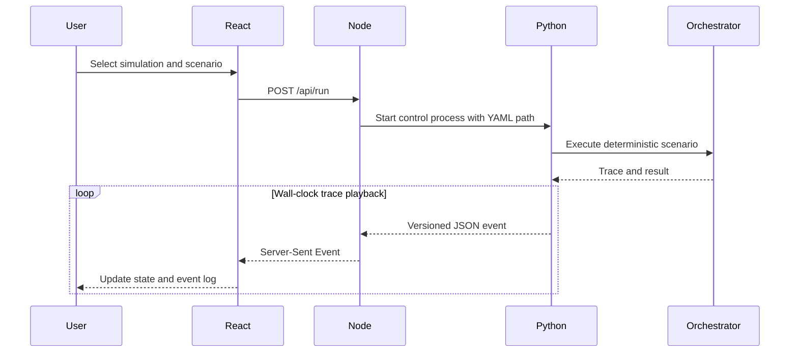

# Edge computer and control GUI

Status: control GUI and recorded-video regression implemented; physical preview
transport remains future work.

## Operator UI

Edge Control uses the shared BearVision operator shell from Server Control while
retaining an Edge-specific workflow: configure, run, observe and verify. The
preview is the primary work surface; connection/runtime health and the event
trace are supporting evidence. All existing scenario, capture, processed-video
and tracking views remain available when their artefacts exist.

The normative UX/UI baseline and acceptance checks are in
[`ui-design-criteria.md`](ui-design-criteria.md).

## Deployment boundary

The Edge computer hosts both runtimes. BearVision 3 supports Windows and 64-bit
Linux for development and production deployment. Hardware sizing and physical
adapter validation are device-profile questions, not application-architecture
decisions.


Node is deliberately a thin shell. Edge Python owns capture and packaging;
server Python separately owns BearTag scoring, historical lookup and terminal
placement. Neither React GUI duplicates those policies.

## Behavioural scenario playback



The scenario is executed deterministically first and its trace is then replayed
at wall-clock speed. For a video scenario, React plays the emulator's preview
source on the same media timestamps as Python's frame-analysis trace. This is
sufficient for repeatable UI behaviour testing, but it is not a physical
real-time simulation.

## Scenario schema 3.x sources

Each scenario explicitly selects the adapter behind each port:

| Part | Current choices |
|---|---|
| Frames | `synthetic`, `video`, `gopro` |
| Detector | `declared`, `yolo` |
| BearTag | `synthetic`, `ble` |
| Camera | `simulated`, `simulated_gopro`, `gopro` |
| Storage | `memory`, `box` |

The schema can express future physical/hybrid combinations. The behavioural
runtime currently implements two deliberately tested compositions only:

- fully synthetic with declared detections;
- recorded preview + GoPro emulator + real YOLO + synthetic BearTag +
  in-memory storage.

The GUI's Hardware mode uses the physical composition from `config/edge.yaml`;
arbitrary mixed physical/simulated compositions are not implemented yet and
fail explicitly instead of silently selecting the wrong adapter.

`wakeboard-video-yolo.yaml` combines the checked-in 15.3-second preview video,
the real bundled YOLOv8n model and deterministic 10 Hz RSSI/accelerometer data.
YOLO detects the rider at approximately T+6.0 s; Edge publishes the resulting
clip and whole-window evidence, after which the simulated server worker assigns
`rider-video@scenario.invalid`.

The GoPro emulator uses the packaged FFmpeg/FFprobe executables to materialize
the configured HindSight window plus post-detection recording on its own
disk-backed SD card. It exposes GoPro-style `100GOPRO/GX01xxxx.MP4` media,
which the production `GoProCameraAdapter` lists and downloads to the Edge
capture directory. The preview source remains unchanged.

Before upload, the virtual-cameraman processor runs person detection across the
whole extracted clip. A forward two-dimensional position/velocity Kalman pass
performs normalized-innovation gating, and a Rauch--Tung--Striebel backward pass
uses later detections to improve earlier states and covariances. A separate
second-order Butterworth path runs forward and backward to create a zero-phase,
low-jitter crop trajectory. It publishes three additional artefacts:

- `*.virtual-cameraman.mp4`: the cropped, silent H.264 upload file;
- `*.tracking-debug.mp4`: green YOLO boxes, red Kalman + RTS estimate plus a
  conservative circular 95% region, and the cyan Butterworth crop window;
- `*.tracking.json`: frame-level measurements, estimates, covariance and crop.

The video scenarios package only the processed file. Edge Control lets
the operator switch among source, raw extracted clip, upload clip and tracking
view. A green box means a detected person; rider identity comes later from the
server worker.

Crop ratio, sampling rate, output dimensions and final H.264 CRF are configured
under `virtual_cameraman` in `config/edge.yaml`. The active 1080p policy uses a
50% width crop and writes `960x540` at CRF 18, preserving the crop's native
pixel dimensions instead of reducing it to a low-resolution preview.

Edge Control only serves scenario metadata/media and supervises Edge Python.
The separate Server Control app supervises the Python worker; only that worker
owns scoring, registry lookup and rider assignment.

Schema 3.1 additionally supports explicit synthetic BearTag samples. The
Blender generator samples rider motion at the configured BearTag rate, converts
world kinematic acceleration to accelerometer specific force (`a - gravity`),
and calculates camera-side RSSI with a declared log-distance path-loss model.
The generated source paths and radio assumptions are retained in the YAML.
The defaults (`-50 dBm` at one metre and path-loss exponent `2.0`) are test
assumptions, not measured BearTag calibration values.

```powershell
uv run bearvision-generate-blender-scenario `
  tests/end2end/blender_scenes/wakeboard_fs360_60fps --force
```

Generated files under `specs/scenarios` appear in Edge Control's Simulation
scenario selector and can be replayed manually like any other video scenario.

## Known gaps

- The old React source under `temp/EDGE Application GUI Design` was an ignored
  mockup with mock events and no backend.
- The PyQt Edge GUI is wired to the legacy state machine, not BearVision 3.
- Hardware-mode preview transport is not implemented in Edge Control yet.
- Edge Control has no authentication; do not expose port 4310 outside a trusted
  local network.

## Windows media runtime

`uv sync --locked` installs OpenCV, SciPy for the existing BLE
signal processing, the GoPro SDK and platform-specific FFmpeg/FFprobe binaries
inside `.venv`; administrator access and a system-wide FFmpeg install are not
required. Explicit `BEARVISION_FFMPEG` and `BEARVISION_FFPROBE` paths override
the packaged binaries when deployment policy requires managed tools. The
emulator uses the same base runtime.

Encoding policy is independently versioned in `config/edge.yaml` under
`clip_extraction` and `virtual_cameraman`. The raw extraction uses H.264/AAC,
`veryfast`, CRF 20; the final crop uses H.264 at CRF 18. Mini-PC throughput still
needs measurement on the selected production hardware; CI proves correctness,
not performance.
