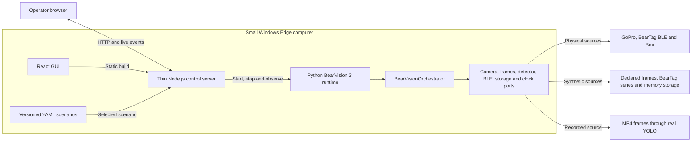
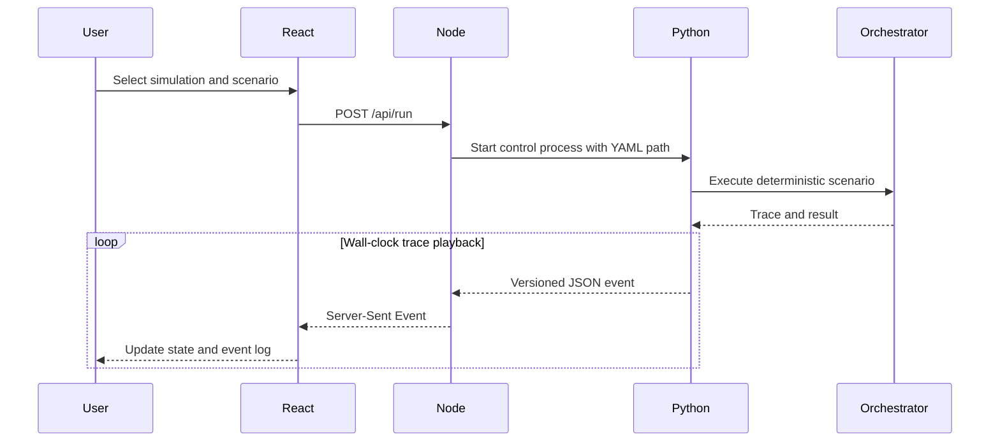

# Edge computer and control GUI

Status: control GUI and recorded-video regression implemented; physical preview
transport remains future work.

## Deployment boundary

The Edge computer hosts both runtimes. BearVision 3 targets a small Windows
computer for both development and production deployment. Hardware sizing is a
benchmarking question, not an application-architecture decision.

Node is deliberately a thin shell. Python owns the orchestrator, contracts and
all decisions. The React GUI must never duplicate rider assignment or capture
policy.

## Behavioural scenario playback

The scenario is executed deterministically first and its trace is then replayed
at wall-clock speed. For the recorded-video scenario, React plays the source
video on the same media timestamps as Python's frame-analysis trace. This is
sufficient for repeatable UI behaviour testing, but it is not a physical
real-time simulation.

## Scenario schema 3.0 sources

Each scenario explicitly selects the adapter behind each port:

| Part | Current choices |
|---|---|
| Frames | `synthetic`, `video`, `gopro` |
| Detector | `declared`, `yolo` |
| BearTag | `synthetic`, `ble` |
| Camera | `simulated`, `recorded_video`, `gopro` |
| Storage | `memory`, `box` |

The schema can express future physical/hybrid combinations. The behavioural
runtime currently implements two deliberately tested compositions only:

- fully synthetic with declared detections;
- recorded video + real YOLO + synthetic BearTag + in-memory storage.

The GUI's Hardware mode uses the physical composition from `config/edge.yaml`;
arbitrary mixed physical/simulated compositions are not implemented yet and
fail explicitly instead of silently selecting the wrong adapter.

`wakeboard-video-yolo.yaml` combines the checked-in 15.3-second preview video,
the real bundled YOLOv8n model and deterministic 10 Hz RSSI/accelerometer data.
YOLO detects the rider at approximately T+6.0 s; the resulting five-second clip
window assigns `rider-video` using its whole-window BearTag evidence.

Node only serves scenario metadata/media and supervises Python. Python remains
the owner of synchronization, YOLO, capture and rider assignment.

## Known gaps

- The old React source under `temp/EDGE Application GUI Design` was an ignored
  mockup with mock events and no backend.
- The PyQt Edge GUI is wired to the legacy state machine, not BearVision 3.
- Hardware-mode preview transport is not implemented in Edge Control yet.
- `recorded_video` currently returns the complete reference media as the
  captured asset. Extracting the exact detection-to-clip-end segment is the
  next camera-adapter slice.
- Edge Control has no authentication; do not expose port 4310 outside a trusted
  local network.
