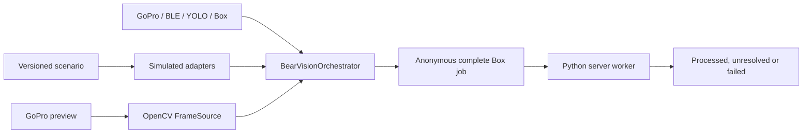

# BearVision 3 foundation

Status: implemented foundation; hardware calibration and endurance testing are
still required before production deployment.

BearVision 3 is built around executable specifications and deterministic
behavioural simulation. The fast in-memory adapters model orchestration
behaviour, timing and failures. The disk-backed GoPro controller simulator adds
control and media fidelity, but does not claim firmware or transport accuracy.

## One orchestration core

Both behavioural and production composition drive `BearVisionOrchestrator`.
Only adapters differ:

Vision triggers a fixed-duration clip but never supplies rider identity or a
jump timestamp. Edge uploads every BearTag sample in the UTC clip interval but
has no user registry and performs no scoring. The server evaluates each known
BearTag's acceleration and median RSSI, then resolves the winner against the
historical UTC registry. Thresholds and weights are calibration starting points.

## Configuration

The Edge configuration is schema version 3.0. Score policy and the historical
registry live only in the independently versioned server configuration.

## Quality gate

The default `pytest` invocation runs the active BearVision 3 behavioural suite.
Legacy, GUI and physical-hardware checks are deliberately outside that gate and
must use explicit test commands/environments.

The GoPro simulation boundary and its remaining fidelity gaps are documented in
`docs/remake/gopro-simulator.md`.
