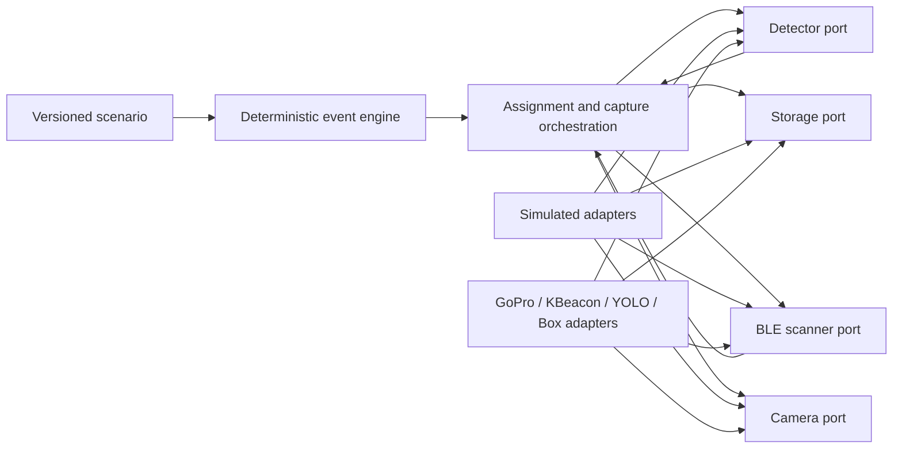

# BearVision 3 foundation

BearVision 3 is being rebuilt around executable specifications and deterministic
behavioural simulation. The simulator models component behaviour, timing and
failures. It does not claim physical accuracy and has no rendering dependency.

## Development

```bash
python -m pip install -e ".[dev]"
python -m pytest tests/remake
```

The active package lives under `src/bearvision`. Legacy implementations remain
available behind production adapters; domain and simulation code do not import
their SDKs.

Run the first complete behavioural scenario with:

```bash
python tools/run_behavioral_scenario.py specs/scenarios/single-rider-success.yaml
```

## Behavioural composition



Vision can trigger capture but never supplies rider identity. Only recent,
registered BLE observations enter the assignment policy. Zero candidates are
`unassigned`; multiple candidates are `ambiguous`.
