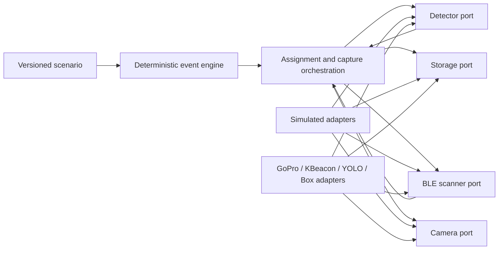

# BearVision 3 foundation

BearVision 3 is being rebuilt around executable specifications and deterministic
behavioural simulation. The simulator models component behaviour, timing and
failures. It does not claim physical accuracy and has no rendering dependency.

## Development

```bash
python -m pip install -e ".[dev]"
python -m pytest tests/remake
```

The active package lives under `src/bearvision`. Legacy implementations remain
available behind production adapters; domain and simulation code do not import
their SDKs.

Run the first complete behavioural scenario with:

```bash
python tools/run_behavioral_scenario.py specs/scenarios/single-rider-success.yaml
```

## Behavioural composition



Vision triggers a fixed-duration person clip but never supplies rider identity.
The policy evaluates every registered BearTag accelerometer sample recorded
during that complete clip together with median RSSI from the same interval.
Mean acceleration activity magnitude makes the motion evidence independent of
tag orientation without letting signed axes cancel. Candidates must pass the
sample-count, motion and RSSI gates; close combined scores remain `ambiguous`.

The initial fusion policy is configurable in `config/edge.yaml`. Its 70% motion
and 30% RSSI weights and thresholds are calibration starting points—not proven
physical constants.
