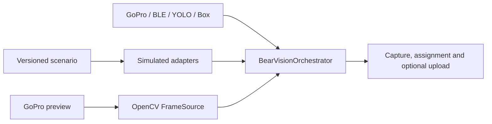

# BearVision 3 foundation

Status: implemented foundation; hardware calibration and endurance testing are
still required before production deployment.

BearVision 3 is built around executable specifications and deterministic
behavioural simulation. Simulation models component behaviour, timing and
failures; it does not claim physical accuracy.

## One orchestration core

Both behavioural and production composition drive `BearVisionOrchestrator`.
Only adapters differ:

Vision triggers a fixed-duration clip but never supplies rider identity or a
jump timestamp. The policy evaluates every registered BearTag accelerometer
sample recorded during the clip together with median RSSI. Thresholds and the
70/30 motion/RSSI weights are calibration starting points, not physical facts.

## Configuration

The edge configuration is schema version 2.0. Only options consumed by the
runtime belong in it. Training, annotation and BLE tooling have independent
versioned configurations.

## Quality gate

The default `pytest` invocation runs the active BearVision 3 behavioural suite.
Legacy, GUI and physical-hardware checks are deliberately outside that gate and
must use explicit test commands/environments.
